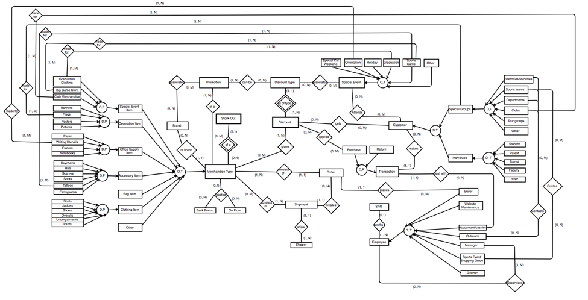
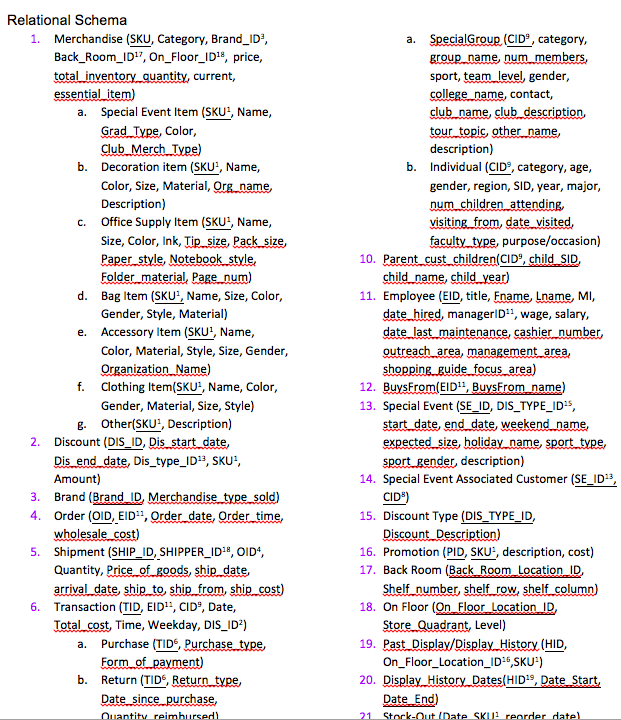

## Student Store Database Design Project
  


We set out to build a robust and functional database for the university Student Store. We believed that a new database to track their sales, purchases, and inventory would allow them to perform processes such as forecasting sales and predicting orders that would ultimately give them a better understanding of their customer, and their store. We planned out all pieces of information needed to perform these processes, and mapped out a clear method for organizing this information in a database including these five search queries, as well as their results. 

1. Worker Forecasting: designed to determine the optimal number of employees needed to operate the store on an average day. We also varied the arrival times of customers to determine how busy the store would need to be in order for the cashier to have no extra time for tasks such as restocking. 

2. Return on Investment: check each promotion’s effectiveness. For each promotion category, we produced a rating that is calculated by using the return on investment (ROI) method. Overall this query will help the Cal Student Store to determine which promotion(s) to emphasize.

    
3. Store Location Analysis: analyze and identify where the most profitable location is for the most popular products sold in the Cal Student Store. This was done by evaluating the average profit of each individual item when placed in each section of the store. We determined where the ten top products should be placed within the store such that no constraint is violated and the total profit is maximized. 

4. Customer Behavior Prediction and Product Recommendation: conduct customer behaviour prediction using machine learning algorithms. We aim to predict the category of product that is most likely to be purchased by customers with different features, and use this prediction to implement target marketing strategy.  We achieved this feature selection and prediction through three different machine learning algorithms - K-Nearest-Neighbor Classification, Logistic Regression, and Classification Tree. 

5. Inventory Time Series Analysis: create an approach for the Student Store to track historical inventory levels of merchandise. We applied time series models: ARIMA model and STL model to conduct analysis and prediction. We focused our attention on the occurrences of stock-outs that happen over a two-year time period. These key timestamps, cross-referenced with special events, have the implication that a store manager needs to be prompted to order more products.

**IV. Database Diagram and Schema (partial)**
  
  

**SQL Queries and Modeling** 

Details please see SQL Queries folders


