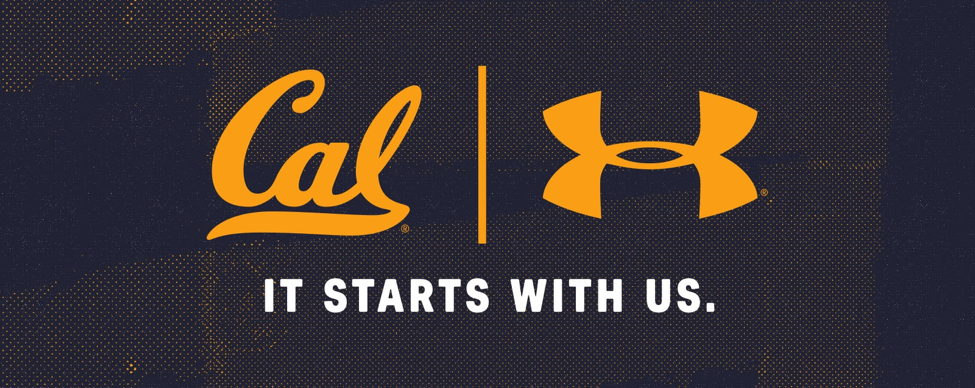

# Cal Student Store Database Design Project

  
  

#### Table of Contents

I.	Executive Summary  
II.	Client Description  
III.	Previous Approaches & Goals (Changes & Goals)  
IV.	Access Screenshots
V.	Normalization Analysis  
VI.	Client Letter  
VII.	Team Member Contributions  
VIII.	Discussion & Future Work  
IX.	Appendix 

**I. Executive Summary**  

We set out to build a robust and functional database for the Cal Student Store. By initially feilding vast research into the retail merchandise sector, we were able to understand the methods used to track products from order to purchase. Once this was understood, we outlined general goals for the semester long project that would benefit the Cal Student Store. In short, we believed that a new database to track their sales, purchases, and inventory would allow them to perform processes such as forecasting sales and predicting orders that would ultimately give them a better understanding of their customer, and their store. We planned out all pieces of information needed to perform these processes, and mapped out a clear method for organizing this information in a database including these five search queries, as well as their results. 

Worker Forecasting

This query is designed to determine the optimal number of employees needed to operate the store on an average day. This was determined with two different simulation softwares: Sigma and Simio. We also varied the arrival times of customers to determine how busy the store would need to be in order for the cashier to have no extra time for tasks such as restocking. 

Return on Investment

The purpose of query 2 is to check each promotion’s effectiveness. For each promotion category, we produced a rating that is calculated by using the return on investment (ROI) method. ROI is obtained by calculating total revenue of investment subtract by cost of investment and dividing this with cost of investment (Through this query our client will be able to see which promotion provided profit and which resulted in a loss. Overall this query will help the Cal Student Store to determine which promotion(s) to emphasize.

    
Store Location Analysis

The purpose of query 3 is to analyze and identify where the most profitable location is for the most popular products sold in the Cal Student Store. This was done by evaluating the average profit of each individual item when placed in each section of the store then ranking these products by average profit. Once products were ranked, AMPL was used to maximize the total profit given certain space constraints. Using the binary AMPL output, we determined where the ten top products should be placed within the store such that no constraint is violated and the total profit is maximized. 

Customer Behavior Prediction and Product Recommendation 

The purpose of query 4 is to conduct customer behaviour prediction using machine learning algorithms. We aim to predict the category of product that is most likely to be purchased by customers with different features, and use this prediction to implement target marketing strategy. We performed feature selection to extract important features and used them to predict which product category is mostly likely to be purchased by different types of customers under certain conditions. We achieved this feature selection and prediction through three different machine learning algorithms - K-Nearest-Neighbor Classification, Logistic Regression, and Classification Tree. 

Inventory Time Series Analysis 

The purpose of Query 5 is to create an approach for the Cal Student Store to track historical inventory levels of merchandise. Since our database only keeps track of the current inventory level of each merchandise item, we needed to combine this information with past transaction data and shipment data related to this item in order to calculate its past inventory levels. 
We applied time series models: ARIMA model and STL model to conduct analysis and prediction on the data. We focused our attention on the occurrences of stock-outs that happen over a two-year time period. These key timestamps, cross-referenced with special events, have the implication that a store manager needs to be prompted to order more products.

**IV. Database Diagram and Schema (partial)**
  
  

**SQL Queries and Modeling** 

Details please see SQL Queries folders


