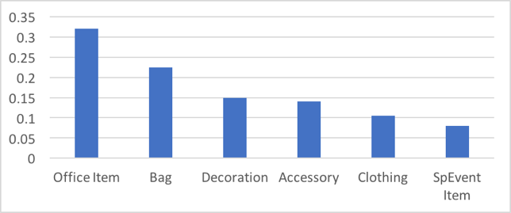
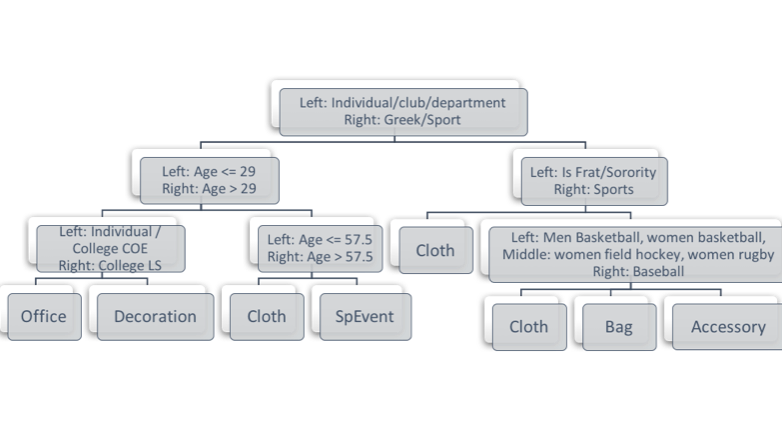

### Query 4 Customer Behavior Prediction

The purpose of query 4 is to find out the category of products that are mostly likely to be purchased by different customers, during both special and non-special event periods. After finding out the product category, the Cal Student Store can implement targeted marketing strategy regarding different customers, thus achieving higher sales. 

Thisis mainly achieved by using machine learning algorithms. We use three types of features:
    
●	Customer Related Features:
Is_group, Frat/Sorority, Sports team, Department, … Is_student, Is_parent, … gender, year, major, region  
●	Time Related Features:  
Date, Special Events (1 if the date is within 10 days before and after for special event)  
●	Price Related Features:
Price, promotion, discount, cost
We use these features to try to predict the product category (e.g. Special Event Item, Clothing, Bag... etc) a particular group would be most interested in. 

	SELECT TC.TID, TC.Is_group, TC.Group_Name, 
	TC.Sport, TC.College_Name, TC.Club_Name, 
	IIf(TC.Category="Student",1,0) AS Is_Student, IIf(TC.Category="Parent",1,0) AS Is_Parent, IIf(TC.Category="Tourist",1,0) AS Is_Tourist, IIf(TC.Category="Faculty",1,0) AS Is_Faculty,
	TC.Age, TC.Gender, TC.Student_Year, TC.Student_Major, TC.Region, TC.Transaction_Date, TP.Quantity, TS.Special_dates, M.Price, D.Amount_of_Dis,
	M.Category
	FROM 
	(SELECT T.TID, T.Transaction_Date, T.DIS_ID, C.Is_group,
	C_SG.Group_Name, C_SG.Sport, C_SG.College_Name, C_SG.Club_Name, 
	C_I.Category, C_I.Age, C_I.Gender, C_I.Student_Year, C_I.Student_Major, 
	C_I.Region
	FROM (((Transaction AS T 
	LEFT JOIN Customer AS C ON T.CID = C.CID) 
	LEFT JOIN Special_Group AS C_SG ON T.CID = C_SG.CID) 
	LEFT JOIN Individual AS C_I ON T.CID = C_I.CID)
	)  AS TC,
	(SELECT T.TID, SUM( IIF(T.Transaction_Date BETWEEN DATEADD( "d", -10, S.start_date)  AND DATEADD( "d", 10, S.end_date), 1, 0) )AS Special_dates
	FROM Transaction T, Special_Event S
	GROUP BY T.TID) TS,
	Transaction_Product AS TP, Merchandise AS M, Discount AS D
	WHERE TC.TID = TP.TID AND M.SKU = TP.SKU AND TS.TID = TC.TID AND D.Dis_ID = TC.Dis_ID
	
In order to achieve higher prediction accuracy, we used three different machine learning algorithms so that we could compare and contrast and select the best model. The three algorithms that we used are K-Nearest-Neighbor (KNN) Classification, Logistic Regression, and Classification Tree. 

To see how this model predicts the product category for a particular customer segment, the following plot shows an example of the purchase probability for Club Phoenix during normal time period:

As we can see from the graph, students that are part of Club Phoenix are most likely to purchase office items, followed by a bag or decoration. Hence the promotional email that the student store sends to these students should include information (pictures, promotional events) related to the office items and bags.

The last model is Classification Tree. The model also helped us extract different customer feature importance during different time period:  
●	Normal Time: group name, frat/sorority name, sport name, college name, Is Parent, Is Faculty, Age, Year, Major  
●	Back To School Period: College Name, Club Name, age, gender, year, major  
●	Graduation Period: Department name, Club name, is Tourist, Age, Gender, Major  
●	Sport Event Period: College name, Department name, age, year, major  
To see how the model predicts the product category, we visualized the tree during normal time period: 
 
Using the classification trees, we can make certain reasonable predictions based on the features of the customers. For example, during normal time, an individual or college COE would buy Office Items; during sports events, a male Architecture major student is most likely to purchase Bag Items.




