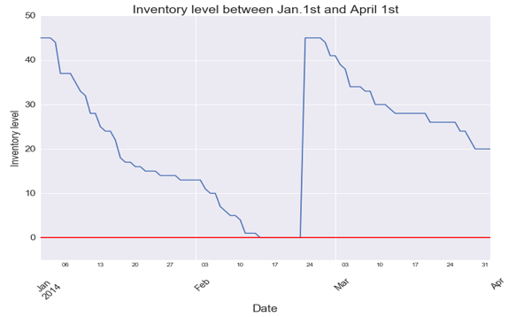
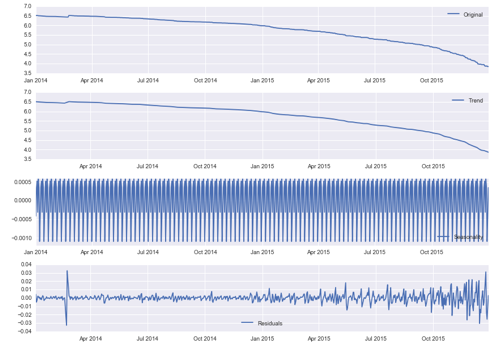
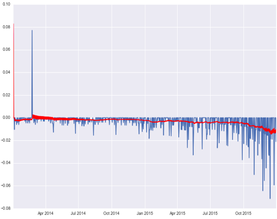
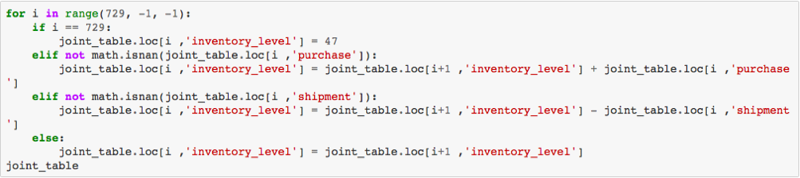
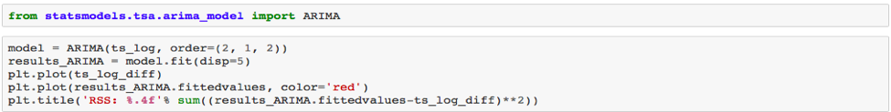
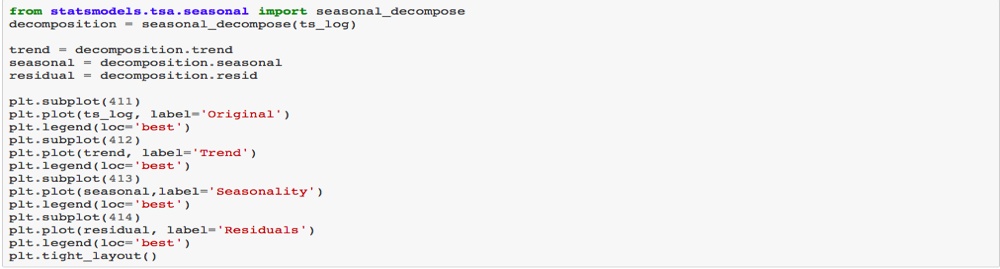

### Query 5 Inventory Time Series Analysis

The purpose of Query 5 is to create an approach for the Cal Student Store to track  the historical inventory level of merchandise items. Being well aware of the merchandise inventory information, the business owner can make more strategic decisions in purchasing inventory by controlling the frequency of restocking. In addition, seasonal time series models allow the store manager to observe the trends and seasonal patterns more precisely, and adjust inventory in the future. In the future, the program can be extended into an alert system API, which interfaces with store’s database and prompts store owner to refill inventory when its level is low.  

The procedure to achieve the above-mentioned goal breaks down into two steps: a data preprocessing step and a modeling step.  

Queries:
1.) Determine the top 10 highest selling products in a 3 year period. User can also decide whichever 

	CREATE VIEW most_popular_items AS
	SELECT SKU FROM (
	SELECT t.SKU, SUM(tp.Quantity) sales 
	FROM Transaction t, Transaction_Product tp 
	WHERE t.Date IS BETWEEN
	“2014-01-01 “ AND “2016-12-31” 
	GROUP BY SKU 
	ORDER BY sales DESC
	LIMIT 10; )

2.) Find all purchase history for these top 10 products

	CREATE VIEW purchase_history AS SELECT t.Date AS date, 
	tp.SKU AS SKU, SUM(t.Quantity) AS purchase
	FROM Transaction t, Transaction_Product tp WHERE t.TID = tp.TID
	AND t.Date IS BETWEEN “2014-01-01 “ AND “2016-12-31”
	AND tp.SKU IN most_popular_items.SKU 
	GROUP BY t.Date, tp.SKU ;

3.) Keep track of all shipping information

	CREATE VIEW shipment_history AS
	SELECT j.SKU AS SKU , s.arrival_date AS date, SUM(s.Quantity) AS shipment FROM Shipment s,
	Junction_Merch_Order j, Order o
	WHERE s.OID = o.OID AND o.OID = j.OID AND s.arrival_date IS BETWEEN “2014-01-01 “ AND “2016-12-31” AND
	j.SKU IN most_popular_items.SKU 
	GROUP BY date, SKU ;

4.) Create a range of dates

date_range = pd.DataFrame({'Date' : pd.date_range('2014-01-01', '2015-12-31')})

5.) Merge all tables

	SELECT strftime('%Y-%m-%d', x.Date) AS Date, x.purchase AS purchase, 
	s.shipment AS shipment, x.current_inventory AS current_inventory
	FROM 
	(SELECT strftime('%Y-%m-%d', d.Date) 
	AS Date, t.purchase, 47 AS current_inventory
	FROM date_range AS d
	LEFT JOIN transaction_history AS t 
	ON strftime('%Y-%m-%d', d.Date) = strftime('%Y-%m-%d', t.Date)) x
	LEFT JOIN shipment_history AS s 
	ON strftime('%Y-%m-%d', x.Date) = strftime('%Y-%m-%d', s.Date)

Algorithms:
The formula of backtracking is the following: 

**Inventory ( t - 1) = Inventory ( t  ) + Purchase ( t ) - Shipment ( t )**

where Start_Date + 1 <= t <= End_Date
and Inventory ( END_Date ) = Current Inventory 
and treat null values as 0. 
A code snippet for the backtracking algorithm is attached in the Appendix.

Time series Analysis:

First by plotting the time series, we especially focus our attention on stock out situations of popular SKUs, e.g. a T-shirt. We pull out the inventory data for the T-shirt from January to April (as shown in figure YYYY) and observe that the inventory level falls below 0 (representing backorders) around mid-February which is tied to a Cal Basketball Game. This indicates the potential demand is not being met.

Then we expand our vision to full time series. We build a seasonal decomposition model to break down the time series into trend (T), cyclical (C), seasonal (S) and irregular noise (I). The formula and the visualization created is the following: 

**y(t) = T(t) +C(t) + S(t) + I(t)**

Besides visualizing the trend component and cyclic component, we also used ARIMA to make predictions of future inventories to capture autocorrelation existing between data.  The formula of ARIMA is the following:
**(1−ϕ1B−⋯−ϕpBp)(1−B)dyt=c+(1+θ1B+⋯+θqBq)et**

Code snippet:

