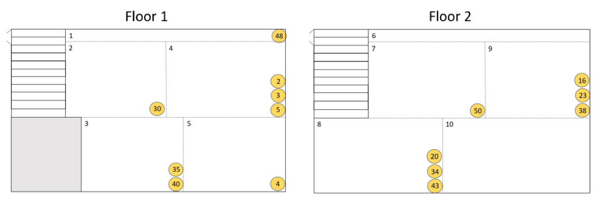

### Query 3 Product Location

The purpose of query 3 is to analyze and identify where the most profitable location is for the most popular products sold in the Cal Student Store. The first part of this query consisted of calculating the average profit of each individual item when it is placed in each section of the store then ranking these products by average profit. To do this, a SQL query to extract the average profit of each product, for each location, and then rank the products was used. The query is as follows: 

	SELECT top 10 dh.Floor_Location_ID AS Floor_Location, 
	dh.SKU AS Product, AVG(tp.quantity * m.price) AS Revenue
	FROM Display_History AS dh, Display_History_Dates AS dhd, 
	Merchandise AS m, [Transaction] AS t, Transaction_Product AS tp
	WHERE dh.Floor_Location_ID = 1
	AND dh.HID = dhd.HID 
	AND dh.SKU = tp.SKU
	AND m.SKU = tp.SKU
	AND tp.TID = t.TID
	AND t.Transaction_Date between dhd.Date_Start and dhd.Date_End
	GROUP BY dh.SKU, dh.Floor_Location_ID;

Once the products were ranked, AMPL was used to maximize the total profit over all locations constrained by the fact that each product could only be placed in one location at a time, and that each location could display up to 3 products at once. AMPL returned a binary result for each product-location pair, indicating whether or not the given product should be placed in the given location. The AMPL code and results can be found in the appendix.

The AMPL optimization produced a binary table indicating the location that each product should be at as shown in figure A. From the SQL and AMPL analysis, we found that:   
●	product 48 should be placed in section 1,  
●	product 30 should be placed in section 2,  
●	products 35 and 40 should be placed in section 3,  
●	products 2, 3, and 5 should be placed in section 4,  
●	product 4 should be placed in section 5,  
●	no products should be placed in section 6,  
●	product 50 should be placed in section 7,  
●	product 20, 34, and 43 should be placed in section 8,  
●	product 16, 23, and 38 should be placed in section 9,  
●	and no products should be placed in section 10.    
The maximized objective profit for the given data is $470.   

To expand on this query, it would be prudent to split the store up into more locations and identify where racks and shelves are typically placed. By doing this, similar items might be placed nearer to each other which might also increase the total profit. Having more locations would also allow the AMPL output to be specific in identifying where each product should be placed. In addition, it is also necessary to create an intermediate step between the SQL query and the AMPL analysis that converts the product-location parameter to binary for the AMPL data. When we did the query for the sample data, we did this by hand; however, the sample data was quite limited, so when actual data from the Cal Student Store is used, there will be a greater amount and a need for an automated way to convert the SQL output to binary. This will most likely be done in Matlab and the needed data will be in the data file of the AMPL code. 
