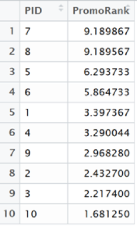

### Query 2 Return On Investment
The purpose of Query 2 is to find which promotions are effective and thus to help our client choose which promotions to emphasize and which promotions change. In order to check the effectiveness for each promotion, not only the cost of the investment, but also the profit of the investment should be considered. This query is mainly achieved by using the economic concept called ROI method. ROI stands for Return On Investment, and the formula is as follows:

ROI = (Investment Gain - Cost) / Cost * 100% 

By using this formula and coding SQL and plots in R, we were able to get the results. The SQL in R that we used for this query is featured in the appendix.
The tables we used in this query were, Merchandise, Promotion, Transaction, Transaction_Products, Transaction_Promotion. Below are the results of how much is needed to process each promotion in descendant order for the cost.

With these two results, total cost (first figure above) and total profit (figure below), we implemented the ROI method and calculated the rankings of each promotion.   

To move further, for even more precise ROI calculations, we may incorporate Net Present Value, which accounts for differences in the value of money over time due to inflation. We could use another concept from economics called Real Rate of Return which is that the application of NPV when calculating rate of return.

