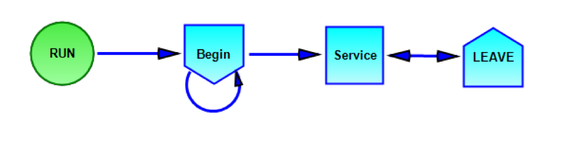
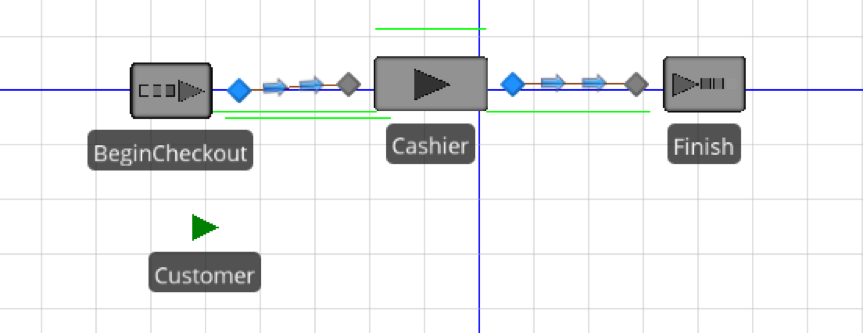

### Query 1 Worker Forecasting

This query was designed to determine the optimal number of employees needed to operate the store on an average day. This was determined with two different simulation softwares: Sigma and Simio. From the data we generated, we were able to use a program called EasyFit in order to fit distributions to the difference in the timestamp of sales as well as checkout time. In order to get this data, the following queries were utilized: 

	SELECT t.Time, t.Transaction_Date
	FROM [Transaction] AS t, Transaction_Product AS tp
	WHERE t.Weekday = 1 and t.TID = tp.TID;

	SELECT t.Time, t.Transaction_Date
	FROM [Transaction] AS t, Transaction_Product AS tp
	WHERE t.Weekday = 0 and t.TID = tp.TID;

The first portion extracted transaction times for weekdays and the second one for weekends. This data was then exported to excel in order to get the differences between times and to convert them into decimal format in order to plot. Based on our generated data, the arrival times were very similar for weekdays and weekends, thus they were treated the same. As for service time, we assumed an underlying transaction time of one minute and added thirty seconds per extra item purchased. The average time came out to be approximately one and a half minutes. Both the arrival and service time ended up being best fit by an exponential distribution.

Below is an image of the system used in Sigma. The model is rather straightforward. It represents a customer entering the checkout line, being serviced, and then exiting the store. 

This is what the same sort of system looked like in Simio. 


After running the simulations, with the service time following an exponential distribution with a mean of one and a half minutes and the arrival time an exponential distribution with a mean of 27.32 minutes, the programs determined an average worker utilization rate of 4.5%. Based on this, most of the time the cashier wouldn’t be processing transactions, leaving a plethora of time for other store functions. However, this arrival time seemed a little low, so we decreased it all the way to five minutes. Even with customers checking out close to every five minutes, the utilization rate only increased to 30%. A more average rate is closer to 80%, therefore, one worker is more than enough for the Cal Student Store to function.

Further worker analysis for the store would be to look into the value of the greeter they currently have. If the greeter isn’t enhancing customer experience then this is a rather costly extra expense. To find out the value, you could survey customers to see how the greeter affected their experience at the store. Alternatively, the store could remove the greeter for a few days and compare sales or just the amount of customers that enter the store. 

